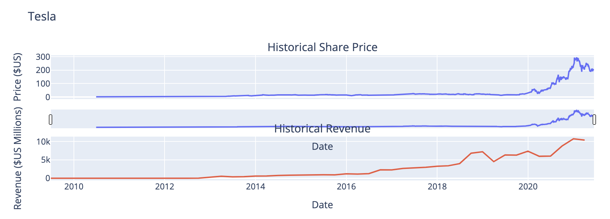
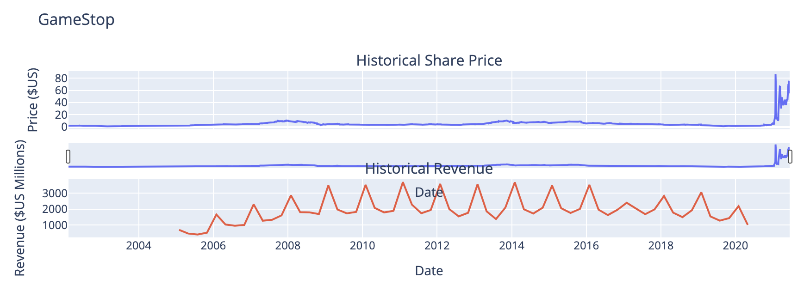

<h1> Analysis and Visualization of Stock Performance </h1>

__Scenario:__  
For this project, you will assume the role of a Data Scientist working for a investment firm that helps customers invest their money in stocks. Your job is to extract financial data like historical share price and quarterly revenue reportings from various sources using Python libraries and webscraping on popular stocks. After collecting this data you will visualize it in a dashboard to identify patterns or trends. The stocks we will work with are Tesla and GameStop.  
 
__Understanding Stock Shares and yfinance:__  
An investor can buy a stock and sell it later. If the stock price increases, the investor profits, If it decreases, the investor with incur a loss. Determining the stock price is complex; it depends on the number of outstanding shares, the size of the company's future profits, and much more. People trade stocks throughout the day. The stock ticker is a report of the price of a certain stock, updated continuously throughout the trading session by the various stock market exchanges. Use the  y-finance API to obtain the stock ticker and extract information about the stock. You will then be asked questions about your results.  

<h2> Step 1: Import the necassary libararies </h2>

__Libraries:__  
 
&nbsp;&nbsp;&nbsp;&nbsp; - yfinance  
&nbsp;&nbsp;&nbsp;&nbsp; - pandas  
&nbsp;&nbsp;&nbsp;&nbsp; - requests  
&nbsp;&nbsp;&nbsp;&nbsp; - BeautifulSoup  
&nbsp;&nbsp;&nbsp;&nbsp; - plotly  

<h2> Step 2: Use yfinance to extract the stock data of Tesla </h2>

1. Use __yf.Ticker('TSLA')__ to extract Tesla stock data and saved it into an variable called 'tesla'.

2. Use the ticker object and the function history to extract stock information and save it in a dataframe named tesla_data. Set the period parameter to "max" so we get information for the maximum amount of time.

&nbsp;&nbsp;&nbsp;&nbsp;&nbsp;&nbsp;&nbsp;&nbsp; __tesla_data = tesla.history(period='max')__

<h2> Step 3: Use Webscraping to Extract Tesla Revenue Data </h2>

1. Save the URL below to a requests object

&nbsp;&nbsp;&nbsp;&nbsp;&nbsp;&nbsp;&nbsp;&nbsp; url = __https://www.macrotrends.net/stocks/charts/TSLA/tesla/revenue__

2. Save the text of the response as a variable named html_data.

3. Parse the html data using beautiful_soup using the parser html.parser.

4. Extract the table on the webpage and store it into a dataframe named tesla_revenue. The column names should be "Date" and "Revenue".

5. Run the follwing line to remove the comma and dollar sign from the Revenue column. 

&nbsp;&nbsp;&nbsp;&nbsp;&nbsp;&nbsp;&nbsp;&nbsp; __tesla_revenue["Revenue"] = tesla_revenue['Revenue'].str.replace(',|\$',"")__

<h2> Step 4: Use yfinance to extract the stock data of GameStop </h2>

1. Use __yf.Ticker('GME')__ to extract GameStop stock data and saved it into an variable called 'gamestop'.

2. Use the ticker object and the function history to extract stock information and save it in a dataframe named gamestop_data. Set the period parameter to "max" so we get information for the maximum amount of time.

&nbsp;&nbsp;&nbsp;&nbsp;&nbsp;&nbsp;&nbsp;&nbsp; __gamestop_data = gamestop.history(period='max')__

<h2> Step 5: Use Webscraping to Extract GameStop Revenue Data </h2>

1. Save the URL below to a requests object

&nbsp;&nbsp;&nbsp;&nbsp;&nbsp;&nbsp;&nbsp;&nbsp; url = __https://www.macrotrends.net/stocks/charts/GME/gamestop/revenue__

2. Save the text of the response as a variable named html_data.

3. Parse the html data using beautiful_soup using the parser html.parser.

4. Extracted the table on the webpage and store it into a dataframe named gamestop_revenue. The column names should be "Date" and "Revenue".

5. Run the follwing line to remove the comma and dollar sign from the Revenue column. 

&nbsp;&nbsp;&nbsp;&nbsp;&nbsp;&nbsp;&nbsp;&nbsp; __gamestop["Revenue"] = gamestop['Revenue'].str.replace(',|\$',"")__

<h2> Step 6: Create Graphs </h2>

Create a function called make_graph that takes 3 parameters: stock_data, revenue_data, and company_name.  
 
__The Tesla graph:__

 

<h3> Insights: </h3>
- Since 2018, Tesla’s share price has seen a significant increase. This is positive sign for potential investors.  
- The company's revenue shows a steady upward trend, indicating strong increasing sales.  

<h3> Final Verdict: </h3>

The share price and revenue both increase over time, which suggests that __Tesla’s stock is good to invest in.__
 
 
 
__The GameStop graph:__

 

<h3> Insights: </h3>
- The price was stable for years but saw a sharp spike in 2021. Upon further research this was due to the meme stock phenomenon rather than business growth.  
- GameStop’s revenue is cyclical and does not show consistent long-term growth, indicating potential business struggles. Furthermore, the spikes in revenue only occur towards the end of the year, during holiday season. This suggest that the company generates its main income from holiday sales.  

<h3> Final Verdict: </h3>

GameStop is a speculative play with high risk and uncertain future performance. Due to a many years of inconsistency, __GameStop’s stock is NOT good to invest in.__

